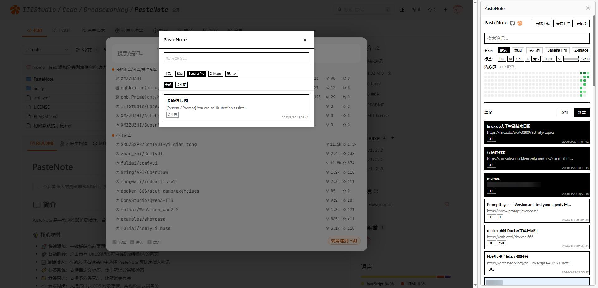

# PasteNote

> 一款功能强大的浏览器侧边栏笔记插件，支持快速记录、分类管理、标签系统、活跃度日历、图片上传与云端同步。

## 📖 简介

PasteNote 是一款基于 Chrome Extension Manifest V3 的侧边栏笔记扩展，帮助用户快速记录和管理知识碎片。支持从当前页面一键捕获链接、8 色笔记系统、GitHub 风格活跃度热力图、图片上传、腾讯云 COS 云端同步，以及右键快捷插入笔记。

### ✨ 核心特性

- 🚀 **快速添加**：一键捕获当前页面 URL 和标题，自动生成 URL 标签笔记
- 📌 **置顶管理**：支持笔记置顶，置顶笔记始终排在最前
- 🎨 **8 色系统**：8 种背景色可选，自由标记笔记类型
- 🖼️ **图片支持**：支持上传图片到图床，悬停预览图片内容
- 🏷️ **标签系统**：自定义标签，多标签组合筛选，按标签快速检索
- 📁 **分类管理**：多分类组织笔记，支持右键重命名 / 删除分类
- ☁️ **云端同步**：基于腾讯云 COS 的自动 / 手动双向同步
- 📅 **活跃度日历**：GitHub 风格贡献热力图，按日期查看笔记分布
- 🔍 **全文搜索**：支持标题、内容、标签搜索，以及 YYYY-MM-DD 日期匹配
- 📋 **右键插入**：在任意输入框右键，选择笔记快速插入内容
- ⌨️ **快捷键**：`Ctrl+Shift+Y` 一键切换侧边栏
- 🎬 **图标动画**：SVG 图标配合精心设计的交互动画

## 🎬 演示视频

[点击观看演示视频](https://www.bilibili.com/video/BV1qbAKzBEsv/)

## 📥 下载安装

### 最新版本（v1.3）

- 最新下载地址：https://cnb.cool/IIIStudio/Code/Greasemonkey/PasteNote/-/releases

### 安装步骤

1. 下载 `PasteNote.zip` 文件
2. 打开浏览器扩展页面：
   - Edge: `edge://extensions/`
   - Chrome: `chrome://extensions/`
3. 开启「开发者模式」（右上角开关）
4. 将 `PasteNote.zip` 文件拖入扩展页面
5. 安装完成后，点击工具栏插件图标或按 `Ctrl+Shift+Y` 打开侧边栏

> [!IMPORTANT]
> 开启「开发者模式」后，浏览器可能会定期提示是否关闭，这是正常的安全提示，请忽略即可。

## 🎯 使用指南

### 添加笔记

| 方式 | 操作 |
|------|------|
| **从当前页面** | 点击侧边栏「添加」按钮，自动获取当前页 URL 和标题 |
| **手动新建** | 点击侧边栏「新建」按钮，填写标题、内容、标签、图片链接 |
| **右键插入** | 在任意输入框右键 →「PasteNote - 插入笔记」→ 选择笔记插入 |

### 笔记操作

| 操作 | 方式 |
|------|------|
| **复制内容** | 单击笔记卡片，自动复制到剪贴板 |
| **打开链接** | 带有 URL 标签的笔记，单击在新标签页打开 |
| **编辑笔记** | 悬停笔记 → 点击画笔图标 |
| **删除笔记** | 悬停笔记 → 点击垃圾桶图标 |
| **置顶/取消** | 悬停笔记 → 点击图钉图标 |
| **更换颜色** | 悬停笔记 → 点击颜色圆点，从 8 色中选择 |
| **查看图片** | 悬停笔记 → 自动显示图片预览（需开启开关） |

### 分类管理

- 点击顶部分类按钮切换分类
- 点击 `+` 按钮添加新分类
- **右键分类**：弹出菜单支持「重命名」和「删除」
- 「默认」分类不可删除

### 标签管理

- 点击标签进行筛选（支持多选）
- 笔记编辑时可添加 / 删除标签
- 在标签管理弹窗中可创建新标签

### 搜索与日历

- **搜索框**：输入关键词搜索标题、内容、标签
- **日期搜索**：输入 `YYYY-MM-DD` 格式精确匹配某天笔记
- **活跃度日历**：GitHub 风格热力图，悬停查看当天笔记数，点击筛选当天笔记

### 数据导入导出

- **本地导入导出**：JSON 格式，支持新旧两种数据结构
- **云端同步**：配置腾讯云 COS（SecretId、SecretKey、Bucket、Region），启用后自动同步
- 启用云同步后按钮变为「云端下载」/「云端上传」

### 图片上传

- 编辑笔记时粘贴图片链接，或点击「上传」按钮选择本地图片
- 支持 JPEG / PNG / GIF / WebP 格式，限制 5MB
- 上传至 p.sda1.dev 图床

## 📁 项目结构

```
PasteNote/
├── manifest.json          # 扩展配置文件 (Manifest V3)
├── background.js          # Service Worker — 右键菜单、侧边栏事件
├── content.js             # 内容脚本 — Shadow DOM 笔记插入模态框
├── sidebar.html           # 侧边栏页面结构
├── sidebar.js             # 侧边栏主逻辑 (~2200 行)
├── popup.css              # 全局样式 — 图标动画、布局
├── cloudSync.js           # 腾讯云 COS 同步模块
├── exportImport.js        # JSON 导入导出模块
├── icons/                 # 图标资源
└── libs/                  # 第三方库 (COS SDK)
```

## 🔧 技术亮点

- **纯原生实现**：零框架依赖，纯 HTML / CSS / JavaScript
- **SVG 图标动画**：使用 CSS @keyframes 实现图钉摆动、画笔波浪、垃圾桶开盖等细腻动画
- **Shadow DOM 隔离**：内容脚本使用 Shadow DOM 注入，样式完全隔离不影响宿主页面
- **无限滚动**：笔记列表支持触底自动加载分页（每页 20 条）
- **智能排序**：置顶笔记优先，其余按创建时间倒序

## 📸 界面预览



## 📄 许可证

本项目采用开源许可证，详见 [LICENSE](LICENSE) 文件。

## 🤝 贡献

欢迎提交 Issue 和 Pull Request！

## 🔗 相关链接

- 项目主页：https://cnb.cool/IIIStudio/Code/Greasemonkey/PasteNote/
- 发布页面：https://cnb.cool/IIIStudio/Code/Greasemonkey/PasteNote/-/releases
