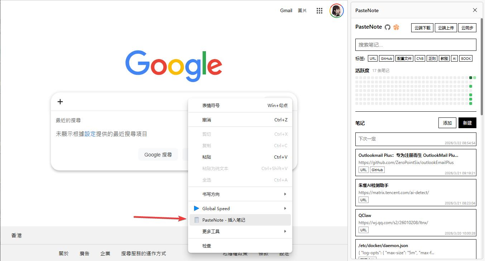
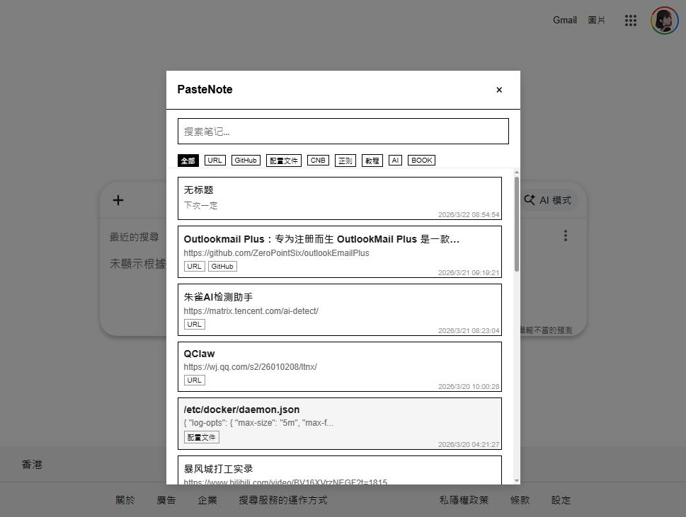

# PasteNote

> 一个功能强大的浏览器笔记插件，支持快速记录、标签管理和云端同步。

## 📖 简介

PasteNote 是一款浏览器扩展插件，旨在帮助用户快速记录和管理笔记。它支持从当前页面捕获信息、分类管理、标签系统以及云端同步功能。

### ✨ 核心特性

- 🚀 **快速添加**：一键捕获当前页面链接和标题，自动添加 URL 标签
- 🔗 **智能跳转**：点击带有 URL 的标签可直接跳转到对应的网页
- 📋 **便捷插入**：在输入框右键菜单中选择 PasteNote 可快速插入笔记
- 🏷️ **标签系统**：支持自定义标签，便于笔记分类和检索
- 📁 **分类管理**：支持多分类管理，让笔记更有序
- ☁️ **云端同步**：支持腾讯云 COS 对象存储，实现数据云端备份
- 🌙 **主题切换**：支持浅色/深色主题切换
- 📅 **日历视图**：按日期查看和管理笔记

## 🎬 演示视频

[点击观看演示视频](https://www.bilibili.com/video/BV1qbAKzBEsv/)

## 📥 下载安装

### 最新版本

- 最新下载地址：https://cnb.cool/IIIStudio/Code/Greasemonkey/PasteNote/-/releases
- 老版本下载：https://cnb.cool/IIIStudio/Code/Greasemonkey/PasteNote/-/releases/download/v1.1.0/PasteNote.zip

### 安装步骤

1. 下载 `PasteNote.zip` 文件
2. 打开浏览器扩展页面：
   - Edge: `edge://extensions/`
   - Chrome: `chrome://extensions/`
3. 开启「开发者模式」（右上角开关）
4. 将 `PasteNote.zip` 文件拖入扩展页面
5. 安装完成后，右键插件图标选择「在侧边栏中打开」

> [!IMPORTANT]
> 开启「开发者模式」后，浏览器可能会定期提示是否关闭，这是正常的安全提示，请忽略即可。

## 🎯 使用指南

### 添加笔记

1. **从当前页面添加**：
   - 点击插件按钮，选择「添加当前页面」
   - 自动获取当前页面的 URL 和标题
   - 生成带有 URL 标签的笔记

2. **手动添加**：
   - 在插件弹窗中点击「添加笔记」
   - 输入笔记内容和标签

3. **右键插入**：
   - 在任意输入框右键
   - 选择「PasteNote」菜单项
   - 选择笔记插入到输入框

### 管理笔记

- **点击笔记**：复制笔记内容到剪贴板
- **点击 URL 标签**：跳转到对应的网页
- **删除笔记**：点击笔记卡片上的删除按钮
- **编辑笔记**：点击编辑按钮修改笔记内容

### 分类与标签

- 创建和管理多个笔记分类
- 为笔记添加自定义标签
- 通过标签快速筛选笔记

### 云端同步

- 支持腾讯云 COS 对象存储自动上传
- 实现跨设备数据同步
- 支持手动同步和自动同步

## 📁 项目结构

```
PasteNote/
├── manifest.json          # 扩展配置文件
├── background.js          # 后台脚本
├── content.js             # 内容脚本
├── popup.html             # 弹窗页面
├── popup.js               # 弹窗逻辑
├── popup.css              # 弹窗样式
├── sidebar.html           # 侧边栏页面
├── sidebar.js             # 侧边栏逻辑
├── cloudSync.js           # 云端同步模块
├── exportImport.js        # 导入导出模块
├── icons/                 # 图标资源
└── libs/                  # 第三方库
```

## 🔧 技术栈

- **浏览器扩展 API**：Chrome Extension Manifest V3
- **存储**：Chrome Storage API
- **云端存储**：腾讯云 COS（对象存储）
- **前端框架**：原生 JavaScript

## 📸 界面预览




## 📄 许可证

本项目采用开源许可证，详见 [LICENSE](LICENSE) 文件。

## 🤝 贡献

欢迎提交 Issue 和 Pull Request！

## 🔗 相关链接

- 项目主页：https://cnb.cool/IIIStudio/Code/Greasemonkey/PasteNote/
- 发布页面：https://cnb.cool/IIIStudio/Code/Greasemonkey/PasteNote/-/releases
