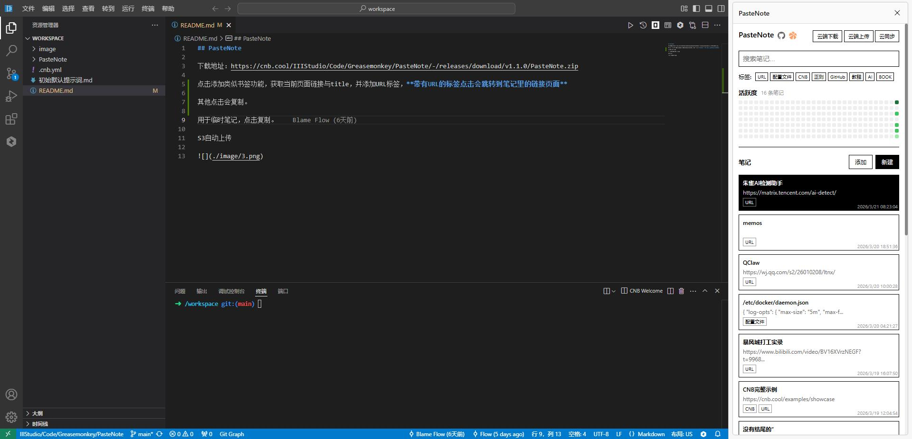

## PasteNote

PasteNote 是一个用于在浏览器中快速添加笔记的插件。

下载地址：https://cnb.cool/IIIStudio/Code/Greasemonkey/PasteNote/-/releases/download/v1.1.0/PasteNote.zip

点击添加类似书签功能，获取当前页面链接与title，并添加URL标签，**带有URL的标签点击会跳转到笔记里的链接页面**

其他点击会复制。

S3自动上传

## 安装方式

下载PasteNote.zip之后打开，edge://extensions/ 开启开发者模式，把文件拖进去安装成功，右键插件可以侧边栏。

